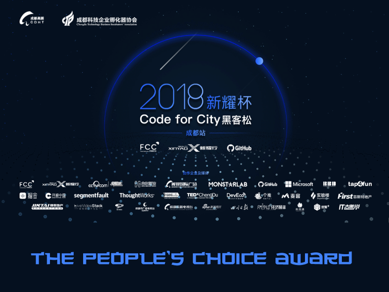
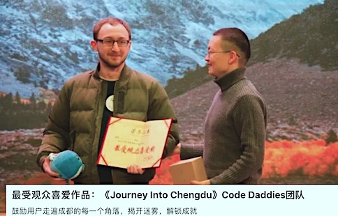
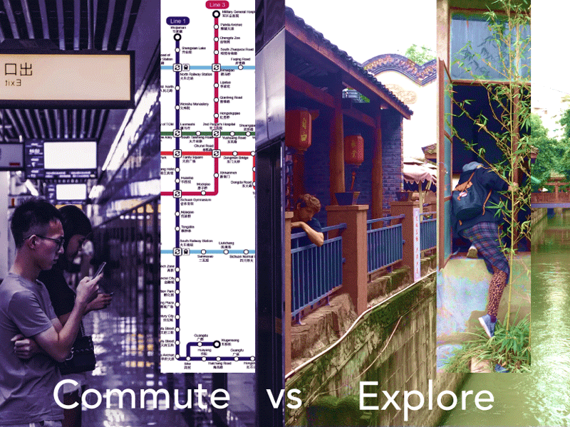
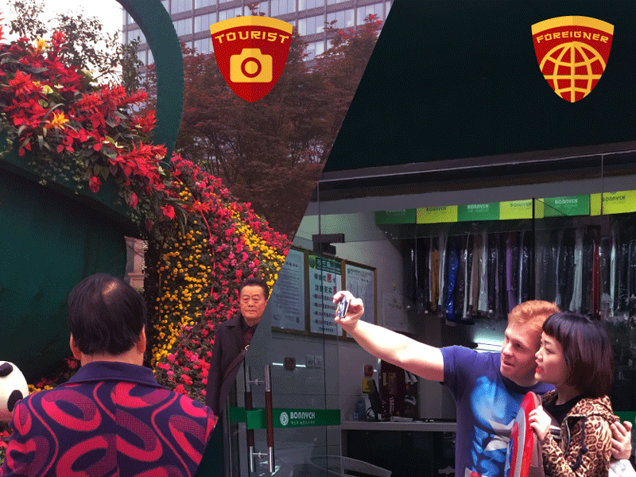
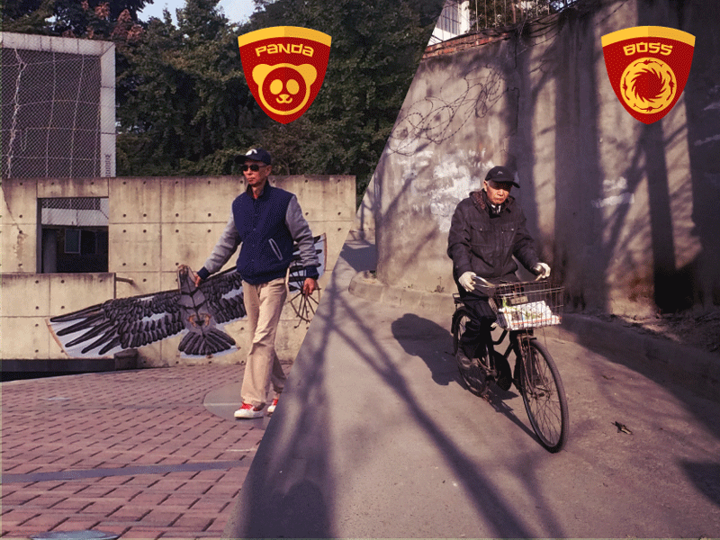
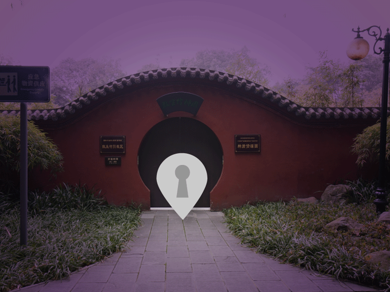
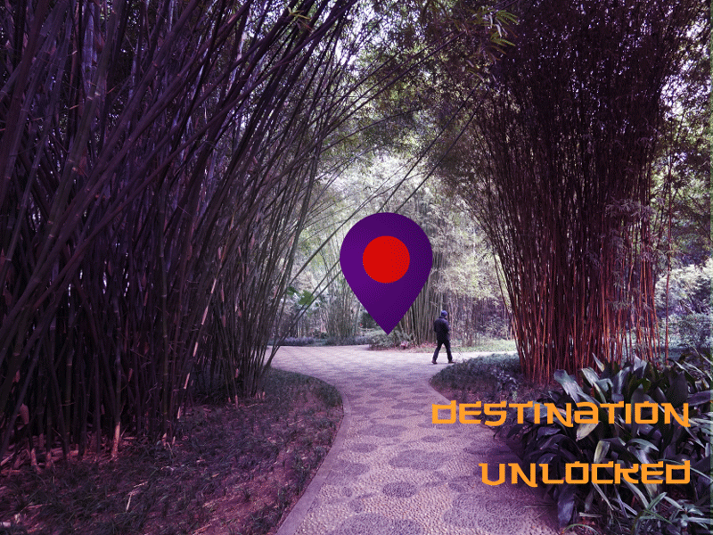

### Hackathon Team Name: 'Code Daddies'

[Free Coding Camp's Chengdu 2018 hackathon](https://mp.weixin.qq.com/s/x5X7dCA_kdx_tkw4XcniNA) had a theme: Code For the City. 48 hours and 9 teams later, Journey Into Chengdu won 'the People's Choice' award (most popular idea).

Dan Engel, Steve Jackson, and I make up the 'Code Daddies' team. Steve received the award for our team.

(#)

(#)

### The Opportunity

We applied the ['fog of war'](https://en.wikipedia.org/wiki/Fog_of_war#In_video_games) concept onto real-life mapping to create an on and offline adventure designed to lure you off the beaten path (i.e. subway and routine commutes) and into the alleyways and hidden nooks and crannies of Chengdu.

After all, the city is much bigger than the small community bubbles we find ourselves in.

(#)

(#)

### Designing Journey Into Chengdu

Icons and achievement badges were created to make a map experience more game like. We could not implement the original inspiration of a 'fog of war' look and feel due to the time and tech constraints.

(#)

(#)

### Building It

The WeChat API allowed us access to a user's location; by recording a user's location (when the mini program was open), the map could render where the 'fog' lifted as a user passed through an area of the map, which was gridified by us on the back-end.

Due to the constraints and challenges (see below) of WeChat, Code Daddies decided that the best way to actually build a serious 'Journey' product was in React Native.

<iframe width="100%" height="300px" style="margin: 0 auto" src="https://www.youtube.com/embed/jNQcDpv_7ao" frameborder="0" allow="autoplay; encrypted-media" allowfullscreen></iframe>

### Challenges

Tencent maps didn't have an easy way to gridify or customize the map experience in the way we needed-- so instead, we used overlay markers that would work the way we wanted them to as long as the user didn't zoom in and out (map markers had to be static image files which could not be rendered responsive).

Storing the data became cumbersome, because the database would have to record and store a user's movement until perpetuity.

(#)

(#)

### Coverage

<a href="https://mp.weixin.qq.com/s/x5X7dCA_kdx_tkw4XcniNA" target="_blank" rel="noopener">FCC 2018黑客松大赛回顾 Hackathon Review</a>
