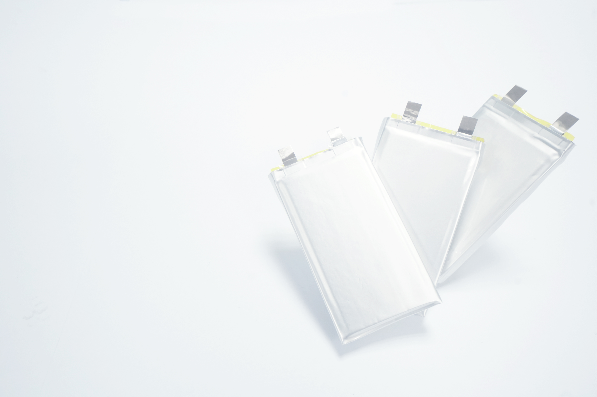
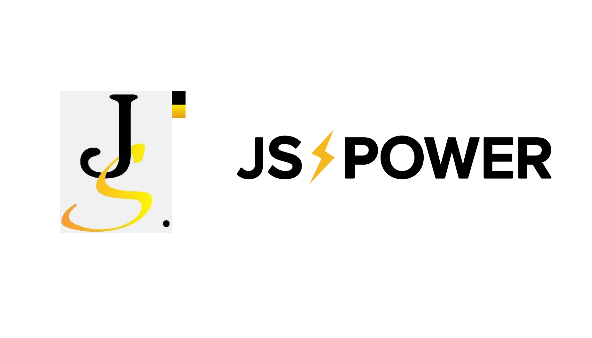
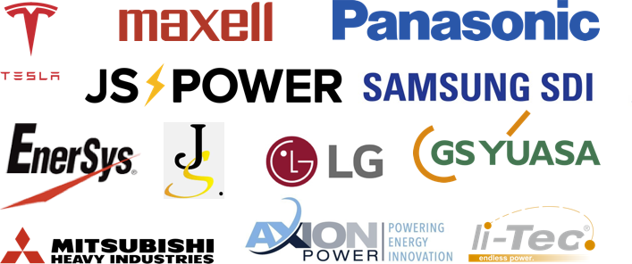
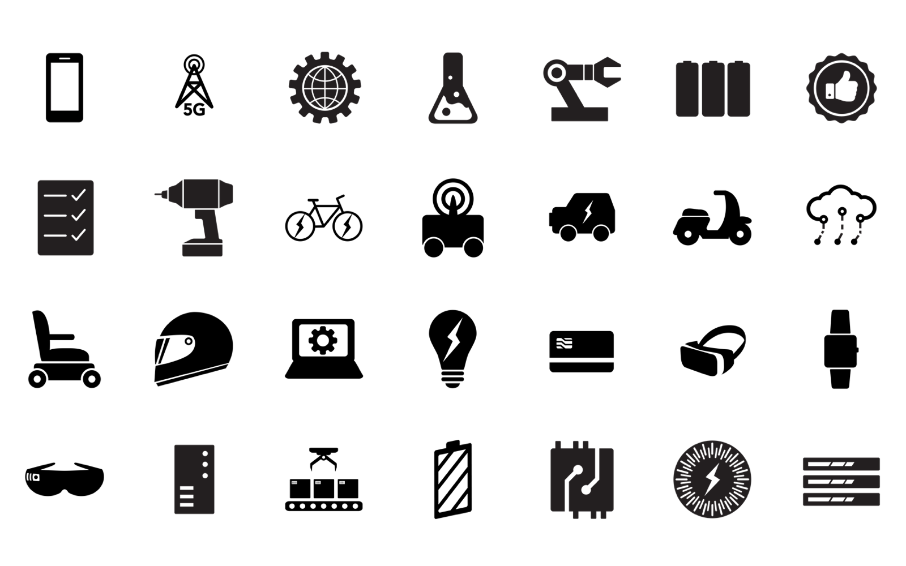
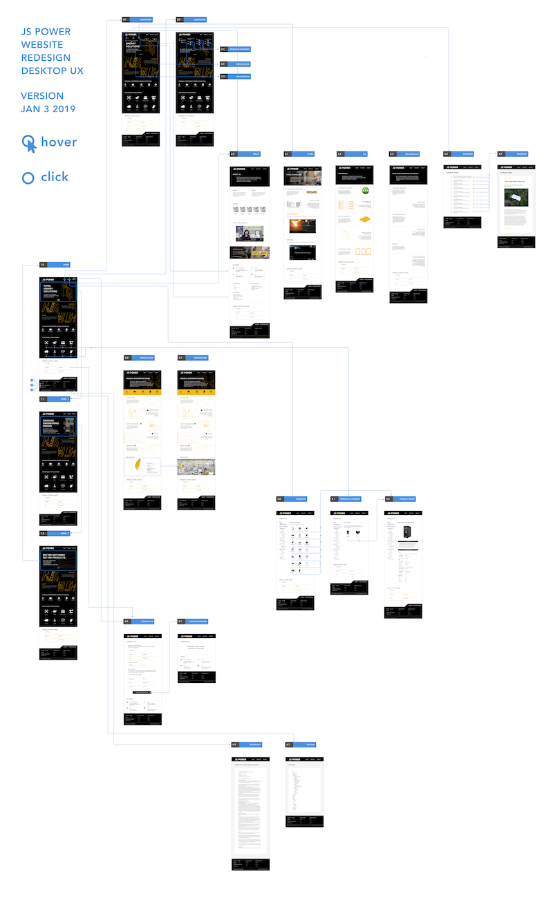
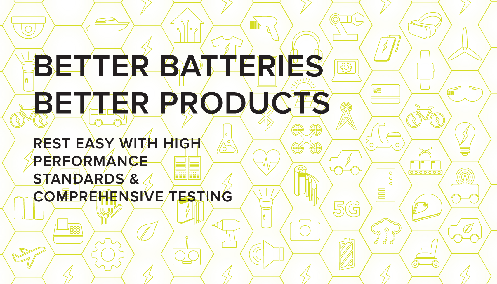

### Learning & Discovery

JS Power boasts 17 years of electrical engineering talent, electro-chemistry knowledge, and mechanical engineering genius in their lithium ion battery manufacturing expertise. The biggest challenge for me-- as well as the most exciting motivation-- was learning about the manufacturing process, delving a bit deeper into the technical complexities, and understanding their business model and strategy within the industry.

As the world turns and 5G telecommunications technology rolls out, the rising demand for their services needed a more international face.

### Rebranding

The previous logo was an outdated aesthetic; the new logos I designed pushed towards a more stylish but timeless look which displayed an international appeal for strength, reliability, and 'power'.

Color choices of black and orange were to stand out against the target competitor's common "blue" color, but also to keep a kind of consistency between the old and the new.

### UX/UI

JS Power's old Geocities-vibe website badly needed upgrading in order to better communicate the reliability and legitimacy of their 17+ year business.

I drafted and edited several design rounds before we settled on a simple, professional portfolio of their product applications.

The main function of the website is to: 1. provide general information and legitimacy to the JS Power brand and products; 2. be able to build a database of potential clients and 3. collect insights on where website visitors are coming from.

### Creative Direction

As the company geared towards the move to their 1Gwh factory in Zhunan, Taiwan, and most of the company staffed by engineers, much of the creative direction was my responsibility.

I handled everything from photographing machinery and the new 1GWh factory to product shoots and graphic design to test different marketing collateral to match their new brand-look.

### Marketing Strategy

Branding strategy for B2B / industrial services commanded a different approach than the usual retail/end-users; I had to think in broad, global strokes, and gain a deeper understanding of JS Power's position in the competitive landscape. JS Power's advantage was not in competitive prices with huge-scale factories based in China; but their flexibility in building custom applications which require high technical skills and experience; custom cell material selection; and STOBA anti-explosion technology.

While the competition in quality is not easy (Panasonic and LGChem produce reliable cells, and are international household brand names),  JS Power has the potential to scoop up clients designing and manufacturing quality products that start out with a custom or lower minimum quantity order, need a reliable life cycle and want a higher guarantee of safety for their end user.

### Business Development

While consulting JS Power on overseas marketing strategies, I also helped research and managed their potential partnerships to enter the India. They are currently on track to sign an MOU with a legitimate top-tier auto components manufacturer (with clients such as Audi, Volkswagen, Tata, Hero Electric, Continental, and emerging EV 2Wheeler startup Ather Energy).

### Project Status

Currently, the website is up and running after working with the dev ops team to deploy my first Ruby on Rails webapp (hey, I learned a little Linux!) with Phusion Passenger standalone on the company web server (the server administrator has never worked with deploying Rails webapps, so I had to learn...fast!). 

I also designed, drafted, and turned over an SOP (standards of procedure) to update the website content and products through the admin dashboard I created. 
