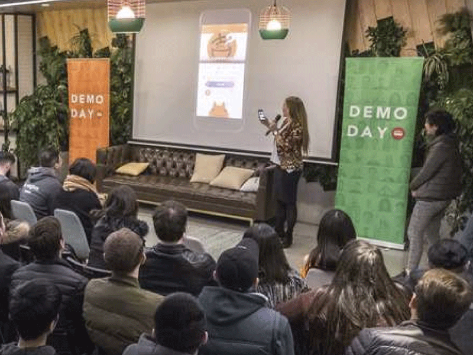
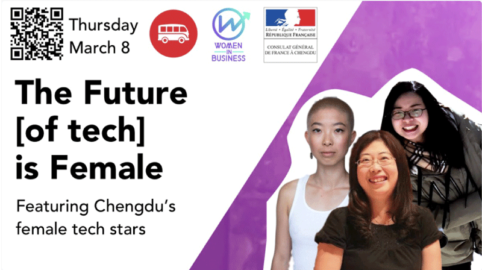
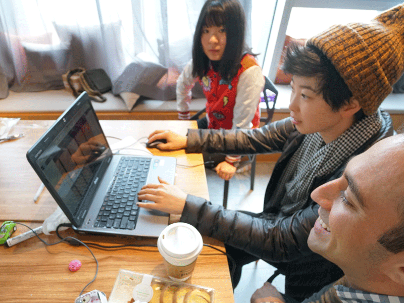
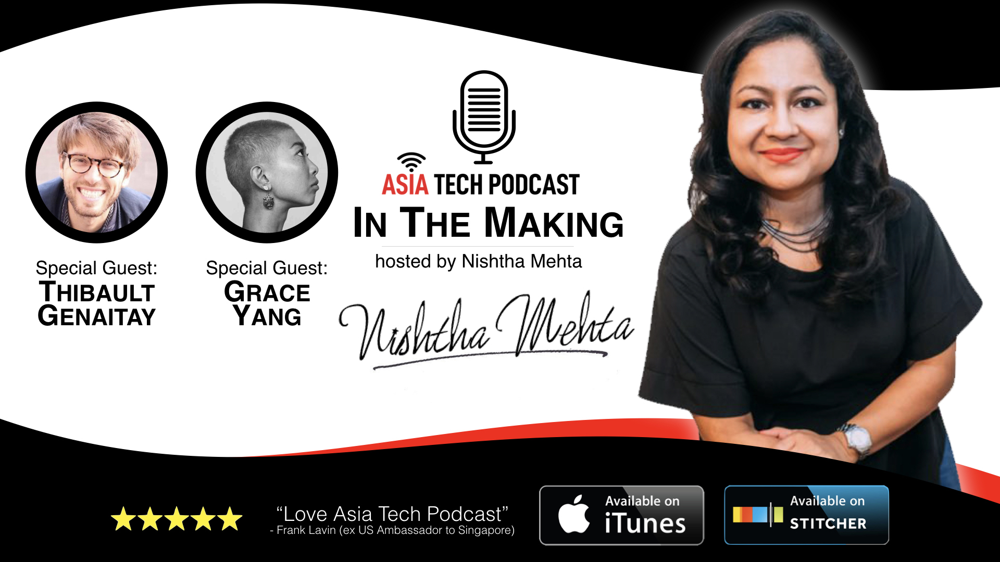

### Le Wagon Chengdu

Le Wagon is a globally ranked #1 coding bootcamp; I became involved with Le Wagon Chengdu as a creative entrepreneur and continue to help grow the community today.

(#)

### UX & UI Design Sprints

I taught the first product design sprint for the very first batch of students in Chengdu in 2017, covering product development, creating user stories, zoning & mockups in Sketch, and prototyping with Invision and/or Marvel.

> Le Wagon is ranked the #1 coding school on Switchup.org

(#)

### Projects & Demo Day

While I myself went on to attend and graduate from the following batch (#114), I continue facilitating the product sprint for Le Wagon Chengdu and often mentor student projects on the front end.

<iframe width="100%" height="300px" style="margin: 0 auto" src="https://www.youtube.com/embed/XNI_36wnhZQ" frameborder="0" allow="autoplay; encrypted-media" allowfullscreen></iframe>

### Startup Weekend

I work with local creative entrepreneurs and software engineers to brainstorm and shape their products.

(#)

### Ladies in Tech

An open and public Women's Day event produced by both Le Wagon and the French Embassy in Chengdu, we looked at the opportunities women have to participate in shaping the future and workshopped product ideas in small groups.

(#)

### High School Tech Bootcamp

Taught product design and front-end development to a small group of high school kids. During the week-long bootcamp, the kids learned how to design a product, mockup and demo prototype on Figma, and code a landing page.

### Coverage

(#)

<a href="http://www.atpstories.com/in-the-making-with-thibault-and-grace-le-wagon-nsh4/" target="_blank" rel="noopener">Asia Tech Podcast</a>

<a href="https://www.switchup.org/bootcamps/le-wagon" target="_blank" rel="noopener">Le Wagon #1 Bootcamp on Switchup.org</a>