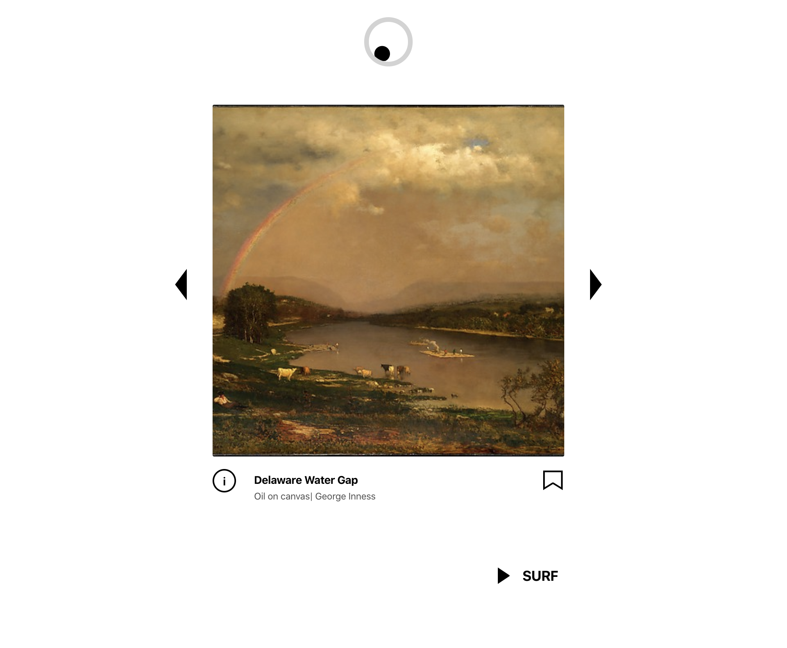

#### Surf The Web Again
Looking to practice React hooks and Redux, I browsed public APIs until I found the Met Collection's digital database. 
This was a great opportunity to build something I would also enjoy using: something to help discover and appreciate different types of art and curate my own gallery. 

This was a fun, creative project that was small enough to dive into and simple enough for me to practice adding features and optimizing performances using a newly learned framework. 

#### The Opportunity
Search engines can help you find what you think or know you'd like to see more of, but what of discovery? 

With a push-economy of ads, algorithmically selected media, and narrowing horizon of 'tastes' mainstreamed directly into your eyeball-feed, the magic of discovery is fading: you can't tell a search engine to surprise you without giving it some kind of prompt, intention, or keyword. I wanted a minimal way to browse an online gallery/collection of art spanning a variety of mediums, histories, culture, and types without having to provide a prompt.

#### Challenges

#### Try It

<a href="https://letsmet-43e41.web.app/" target="_blank" aria-label="Click To Visit Let's Met" rel="noopener">Click here</a> to surf the Metropolitan Museum's digital database and curate your own gallery. 

