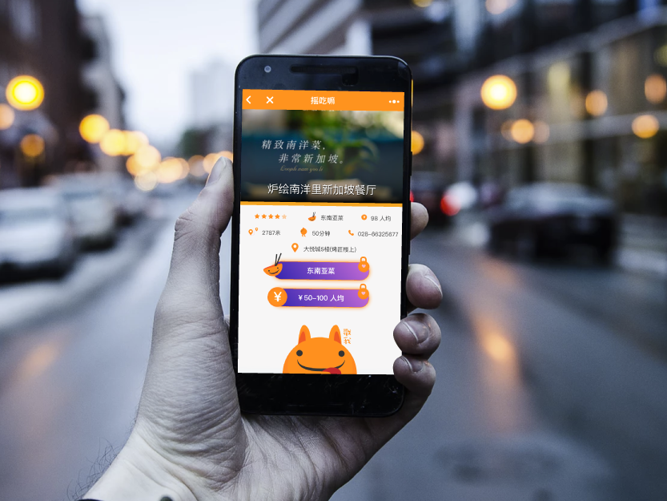
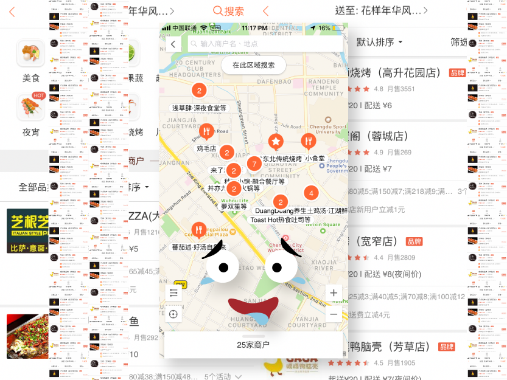
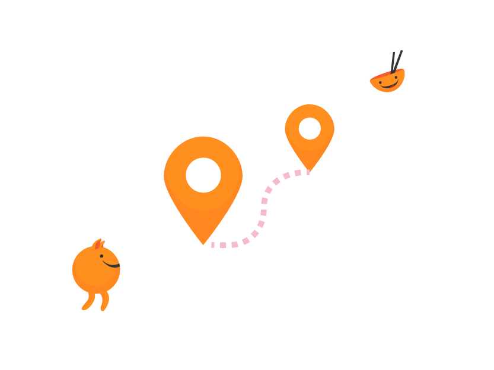
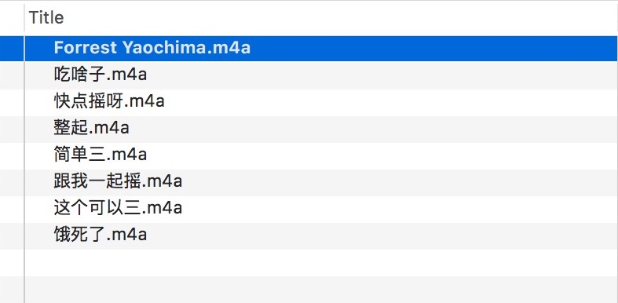
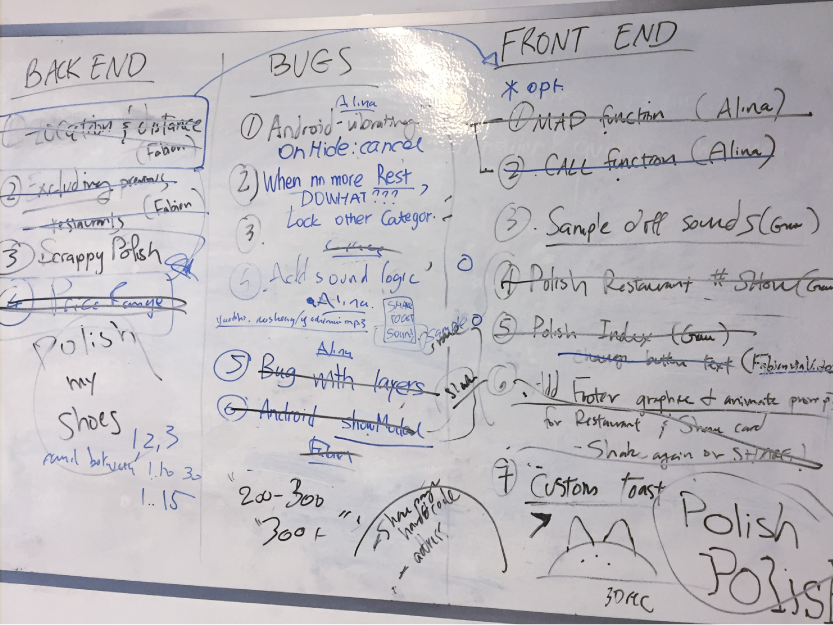

### Discover Places To Eat

Yaochima is a WeChat Mini Program that helps you discover, explore, and find local Chengdu eats with a few shakes of your phone.

### The Opportunity

Local Chinese apps like Dianping or Meituan overwhelm users with endless and infinite possibilities of where to eat. In a city like Chengdu, where it's easy to drown in hot-pot or skewers, Yaochima helps free you from the paradox of choice.

### The Design

To eliminate the panic that accompanies the paradox of choice, the UX encouraged a simple "yes or no" attitude from the user by allowing them to consider a restaurant option in itself (vs. comparing one hot pot restaurant to ten other very similar hot pot restaurants).

The UI + 'shake' effect boosted the 'friendliness' of the app-- an encouragement to play and try new neighborhood spots. This is a direct contrast to the overwhelming amount of options and information a customer sees on the typical Chinese restaurant review platforms.

### The Solution

With each shake of your phone, Yaochima shows you a lottery of nearby restaurants within walking distance. Each result displays cuisine type and price range: if you don't like and lock either parameter and shake again, the cuisine and price range choices are filtered out of future results to truly help you narrow down and  make a quick and efficient decision.

<iframe width="100%" height="300px" style="margin: 0 auto" src="https://www.youtube.com/embed/eYaEUeVMWH0" frameborder="0" allow="autoplay; encrypted-media" allowfullscreen></iframe>

### Challenges

We scraped Dianping, a Chinese app which provides restaurant reviews and food delivery for restaurants around Chengdu.

Figuring out categories and cuisines (and how to scrape, store and use them) was a challenge due to the overlap.

The inconsistent quality of images on Dianping was a design challenge I took the edge off with the creative brand experience of the Mini Program.

### Local Spice

To localize our mini program idea, we recorded, edited, and added Sichuan exclamations to accompany each shake.

### Le Wagon Batch #114 Final Project

Yaochima was my final project. Team members include Fabien Martin (founder of WePlusMinus) and Alina Kabirova (fullstack developer).
